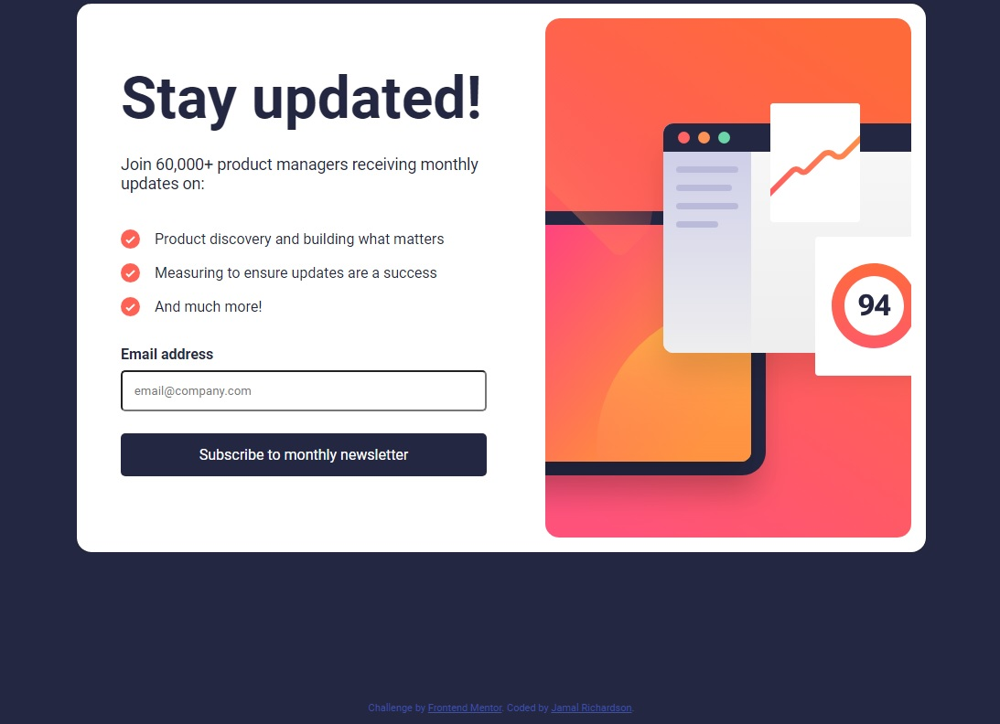

# Frontend Mentor - Newsletter sign-up form with success message solution

This is a solution to the [Newsletter sign-up form with success message challenge on Frontend Mentor](https://www.frontendmentor.io/challenges/newsletter-signup-form-with-success-message-3FC1AZbNrv). Frontend Mentor challenges help you improve your coding skills by building realistic projects.

## Table of contents

- [Overview](#overview)
  - [The challenge](#the-challenge)
  - [Screenshot](#screenshot)
  - [Links](#links)
- [My process](#my-process)
  - [Built with](#built-with)
  - [What I learned](#what-i-learned)
  - [Continued development](#continued-development)
  - [Useful resources](#useful-resources)
- [Author](#author)
- [Acknowledgments](#acknowledgments)

## Overview

### The challenge

Users should be able to:

- Add their email and submit the form
- See a success message with their email after successfully submitting the form
- See form validation messages if:
  - The field is left empty
  - The email address is not formatted correctly
- View the optimal layout for the interface depending on their device's screen size
- See hover and focus states for all interactive elements on the page

### Screenshot

### Links

- Solution URL: [Solution URL here](https://github.com/jamalr55/Newsletter-sign-up-Frontend-Mentor)
- Live Site URL: [Live site URL here](https://jamalr55.github.io/Newsletter-sign-up-Frontend-Mentor/)

## My process

### Built with

- CSS custom properties
- Flexbox
- CSS Grid
- Mobile-first workflow

### What I learned

I learned alot about CSS Flexbox and Responsive Web Design. W3school.com helped me with Viewport & Media Queries.

### Continued development

I plan on growing my knowledge on flexbox by studying more on w3school.com

### Useful resources

- [w3school.com](https://www.w3schools.com/) - This site helped me with HTML & CSS.
- [CSS Flexbox](https://www.w3schools.com/css/css3_flexbox.asp) - This is an amazing article which helped me finally understand CSS Flexbox. I'd recommend it to anyone still learning this concept.

## Author

- Website - [ten18designs.com](https://www.ten18designs.com/)
- Frontend Mentor - [@jamalr55](https://www.frontendmentor.io/profile/jamalr55)

## Acknowledgments

w3school.com
